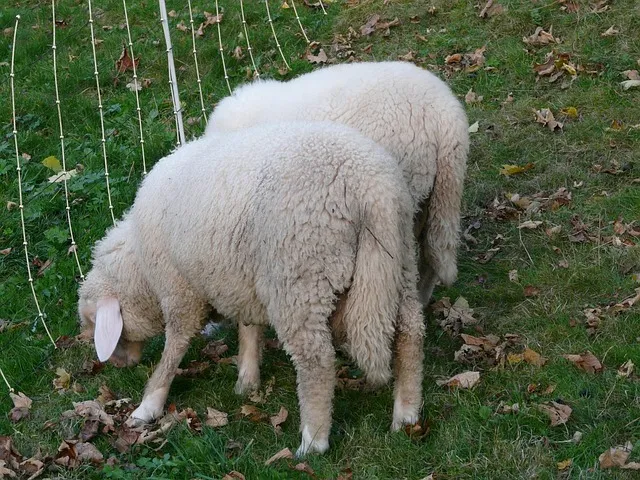
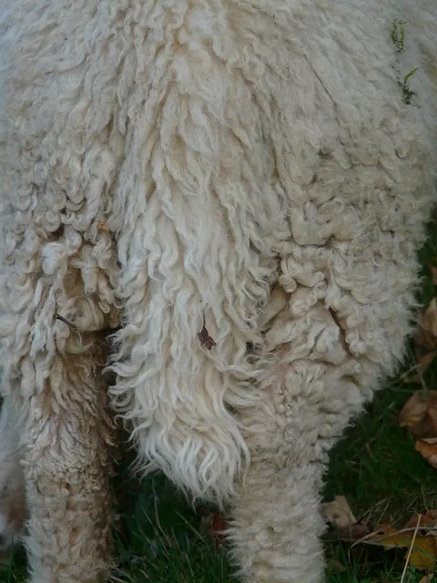

= Images
:author: hituzi no sippo
:email: dev@hituzi-no-sippo.me
:revnumber: v0.5.0
:revdate: 2023-06-16T17:02:40+09:00
:revremark: add image title
:icons: font
:source-highlighter: highlight.js
:highlightjs-languages: asciidoc
:imagesdir: ./
:copyright: Copyright (C) 2023 {author}

// tag::body[]

:asciidoc_docs_url: https://docs.asciidoctor.org/asciidoc/latest

// tag::main[]

:macro_url: {asciidoc_docs_url}/macros

.References
{macro_url}/images/[
Images^]

:pixabay_url: https://pixabay.com
:pixabay_url_with_utm: {pixabay_url}//?utm_source=link-attribution&amp;utm_medium=referral&amp;utm_campaign=image

// tag::block_image[]

.Block (two colons `::`)

// end::block_image[]

:block_image_content_id: 62618
:block_image_url: {pixabay_url}/photos/sheep-pasture-animal-herd-wool-{block_image_content_id}/
:hans_url_with_utm: {pixabay_url}/users/hans-2/?utm_source=link-attribution&amp;utm_medium=referral&amp;utm_campaign=image&amp
{block_image_url}[
Image^] by {hans_url_with_utm}&amp;utm_content={block_image_content_id}[
Hans^] from {pixabay_url_with_utm}&amp;utm_content={block_image_content_id}[
Pixabay^]

:display_code_tag_name: block_image

// tag::display_asciidoc_code[]

:asciidoc_code_file_path: ./images/index.adoc
include::../display_asciidoc_code.adoc[]

// end::display_asciidoc_code[]

// tag::inline_image[]

.Inline (one colon `:`)
For inline images, one colon. 

// end::inline_image[]

:inline_image_content_id: 62616
:inline_image_url: {pixabay_url}/photos/sheep-tail-pasture-animal-herd-{inline_image_content_id}/
{inline_image_url}[
Image^] by {hans_url_with_utm}&amp;utm_content={inline_image_content_id}[
Hans^] from {pixabay_url_with_utm}&amp;utm_content={inline_image_content_id}[
Pixabay^]

:display_code_tag_name: inline_image
include::./index.adoc[tag=display_asciidoc_code]

// tag::image_link[]

:example_image_content_id: 197160
:example_image_url: {pixabay_url}/photos/lawn-green-meadow-pasture-animal-{example_image_content_id}/
.Link (Let's click on the image)
image:example.webp[
link={example_image_url},
window=_blank]

// end::image_link[]

:anna_url_with_utm: {pixabay_url}/users/annaer-35513/?utm_source=link-attribution&amp;utm_medium=referral&amp;utm_campaign=image&amp
:example_image_credit_text: {example_image_url}[ \
Image^] by {anna_url_with_utm}&amp;utm_content={example_image_content_id}[ \
Anna^] from {pixabay_url_with_utm}&amp;utm_content={example_image_content_id}[ \
Pixabay^]
{example_image_credit_text}

:display_code_tag_name: image_link
include::./index.adoc[tag=display_asciidoc_code]

// tag::alt_text[]

.Alt Text
[horizontal]
Position Attribute:: image:alt_text.webp[Position Alt Text]
Named Attribute:: image:alt_text.webp[alt=Attribute Alt Text]

// end::alt_text[]

:display_code_tag_name: alt_text
include::./index.adoc[tag=display_asciidoc_code]

.Read a image from any URL
[NOTE]
====
.References
{macro_url}/image-url[
Insert Images from a URL^]

Can reference image served from any URL.
`\image:<URL>[]`
====

== Size

include::./size.adoc[tag=main, leveloffset=+1]

== Title

include::./title.adoc[tag=main, leveloffset=+1]

// end::main[]

// end::body[]

'''

:author_link: link:https://github.com/hituzi-no-sippo[{author}^]
Copyright (C) 2023 {author_link}
