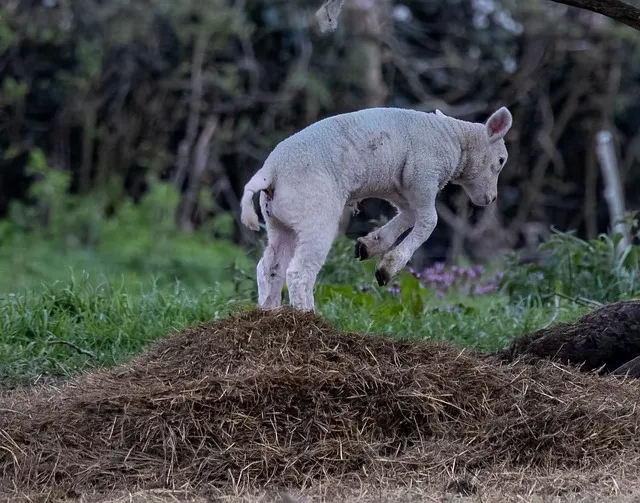

= Position
:author: hituzi no sippo
:email: dev@hituzi-no-sippo.me
:revnumber: v0.4.0
:revdate: 2023-06-23T05:48:53+09:00
:revremark: add float
:source-highlighter: highlight.js
:highlightjs-languages: asciidoc
:imagesdir: ./
:copyright: Copyright (C) 2023 {author}

// tag::body[]

:asciidoc_docs_url: https://docs.asciidoctor.org/asciidoc/latest
:macro_url: {asciidoc_docs_url}/macros

// tag::main[]

:image_position_url: {macro_url}/image-position

:width: 80
:height: 45
:pixabay_url: https://pixabay.com
:pixabay_url_with_utm: {pixabay_url}//?utm_source=link-attribution&amp;utm_medium=referral&amp;utm_campaign=image
== Align

.References
{image_position_url}/#positioning-roles[
Positioning roles - Position and Frame Images^]

Only block image can be used.

// tag::align_text[]

.Default
image::example.webp[Default]

.Left
image::example.webp[Text Align Left, {width}, {height}, align=left]

.Right
image::example.webp[Text Align Right, {width}, {height}, align=right]

.Center
image::example.webp[Text Align Center, {width}, {height}, align=center]

// end::align_text[]

:example_image_content_id: 197160
:example_image_url: {pixabay_url}/photos/lawn-green-meadow-pasture-animal-{example_image_content_id}/
:anna_link: {pixabay_url}/users/annaer-35513/?utm_source=link-attribution&amp;utm_medium=referral&amp;utm_campaign=image&amp;utm_content={example_image_content_id}[Anna^]
{example_image_url}[
Image^] by {anna_link} from {pixabay_url_with_utm}&amp;utm_content={example_image_content_id}[
pixabay^]

:display_code_tag_name: align_text

// tag::display_asciidoc_code[]

:asciidoc_code_file_path: ./images/position.adoc
include::../display_asciidoc_code.adoc[]

// end::display_asciidoc_code[]

== Float

.References
{image_position_url}/#control-float[
Control the float - Position and Frame Images^]

Can be used for both block and inline images.

// tag::float_images[]

.Float
[.float-group]
--
:float_image_size: width=320, height=180
.Float Right

.Float Left

--

// end::float_images[]

:left_image_content_id: 7943528
:left_image_link: {pixabay_url}/photos/sheep-lamb-animals-livestock-farm-{left_image_content_id}/[left^]
:right_image_link: {pixabay_url}/photos/sheep-lamb-animal-livestock-farm-7943527/[right^]
:kev_url_with_utm: {pixabay_url}/users/theotherkev-9436196/?utm_source=link-attribution&amp;utm_medium=referral&amp;utm_campaign=image
Images ({left_image_link}, {right_image_link}) by {kev_url_with_utm}&amp;utm_content={left_image_content_id}[
Kev^] from  {pixabay_url_with_utm}&amp;utm_campaign=image&amp;utm_content={left_image_content_id}[
Pixabay^]

:display_code_tag_name: float_images
include::./position.adoc[tag=display_asciidoc_code]

// end::main[]

// end::body[]

'''

:author_link: link:https://github.com/hituzi-no-sippo[{author}^]
Copyright (C) 2023 {author_link}
