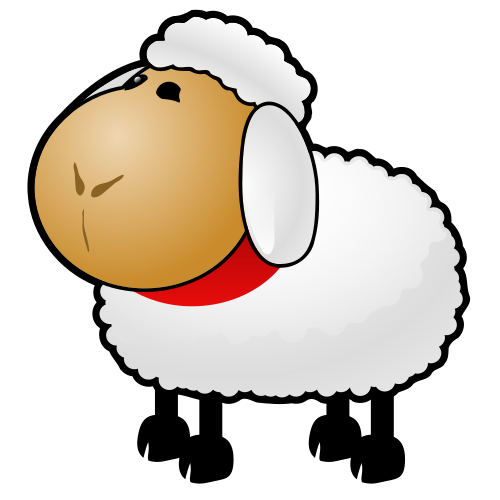

= SVG
:author: hituzi no sippo
:email: dev@hituzi-no-sippo.me
:revnumber: v0.3.0
:revdate: 2023-06-23T06:04:40+09:00
:revremark: add introduction
:source-highlighter: highlight.js
:highlightjs-languages: asciidoc
:imagesdir: ./
:copyright: Copyright (C) 2023 {author}

// tag::body[]

:asciidoc_docs_url: https://docs.asciidoctor.org/asciidoc/latest
:macro_url: {asciidoc_docs_url}/macros

// tag::main[]

.References
{macro_url}/image-svg/[
SVG Image^]

// tag::svg[]

:svg_size: 100
Change Size::
  
The External Object Element `object` (`options=interactive`)::
  
Embedded (`options=inline`)::
  

// end::svg[]

:pixabay_url: https://pixabay.com
:pixabay_url_with_utm: {pixabay_url}//?utm_source=link-attribution&amp;utm_medium=referral&amp;utm_campaign=image
:svg_content_id: 30705
:svg_url: {pixabay_url}/vectors/sheep-white-animal-mammal-mutton-{svg_content_id}/
:clker_free_vector_images_url_with_utm: {pixabay_url}/users/clker-free-vector-images-3736/?utm_source=link-attribution&amp;utm_medium=referral&amp;utm_campaign=image
{svg_url}[Image^] by {clker_free_vector_images_url_with_utm}&amp;utm_content={svg_content_id}[
Clker-Free-Vector-Images^] from {pixabay_url_with_utm}&amp;utm_content={svg_content_id}[
Pixabay^]

:asciidoc_code_file_path: ./images/svg.adoc
:display_code_tag_name: svg
include::../display_asciidoc_code.adoc[]

// end::main[]

// end::body[]

'''

:author_link: link:https://github.com/hituzi-no-sippo[{author}^]
Copyright (C) 2023 {author_link}
