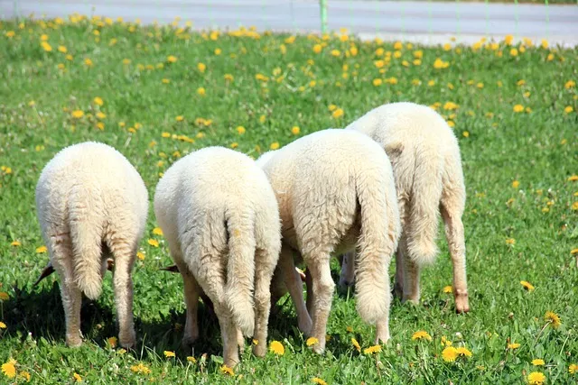

= Title
:author: hituzi no sippo
:email: dev@hituzi-no-sippo.me
:revnumber: v0.3.0
:revdate: 2023-06-23T05:39:17+09:00
:revremark: add introduction
:source-highlighter: highlight.js
:highlightjs-languages: asciidoc
:imagesdir: ./
:copyright: Copyright (C) 2023 {author}

// tag::body[]

:asciidoc_docs_url: https://docs.asciidoctor.org/asciidoc/latest
:macro_url: {asciidoc_docs_url}/macros

// tag::main[]

.References
{macro_url}/image-ref/[
Images Reference^]

:width: 80
:height: 45
:pixabay_url: https://pixabay.com
:pixabay_url_with_utm: {pixabay_url}//?utm_source=link-attribution&amp;utm_medium=referral&amp;utm_campaign=image
:example_image_content_id: 197160
:example_image_url: {pixabay_url}/photos/lawn-green-meadow-pasture-animal-{example_image_content_id}/
:anna_link: {pixabay_url}/users/annaer-35513/?utm_source=link-attribution&amp;utm_medium=referral&amp;utm_campaign=image&amp;utm_content={example_image_content_id}[Anna^]
:example_image_credit_text: {example_image_url}[ \
Image^] by {anna_link} from {pixabay_url_with_utm}&amp;utm_content={example_image_content_id}[ \
Pixabay^]
== Block Image

For block image, display text under the image.

// tag::block_image_title[]

.Use Block Title

// end::block_image_title[]

{example_image_credit_text}

:display_code_tag_name: block_image_title

// tag::display_asciidoc_code[]

:asciidoc_code_file_path: ./images/title.adoc
include::../display_asciidoc_code.adoc[]

// end::display_asciidoc_code[]

== Inline Image

For Inline image, `title` attribute used tooltip.

// tag::inline_image_title[]

.Let's Focus on Image

// end::inline_image_title[]

{example_image_credit_text}

:display_code_tag_name: inline_image_title
include::./title.adoc[tag=display_asciidoc_code]

// end::main[]

// end::body[]

'''

:author_link: link:https://github.com/hituzi-no-sippo[{author}^]
Copyright (C) 2023 {author_link}
